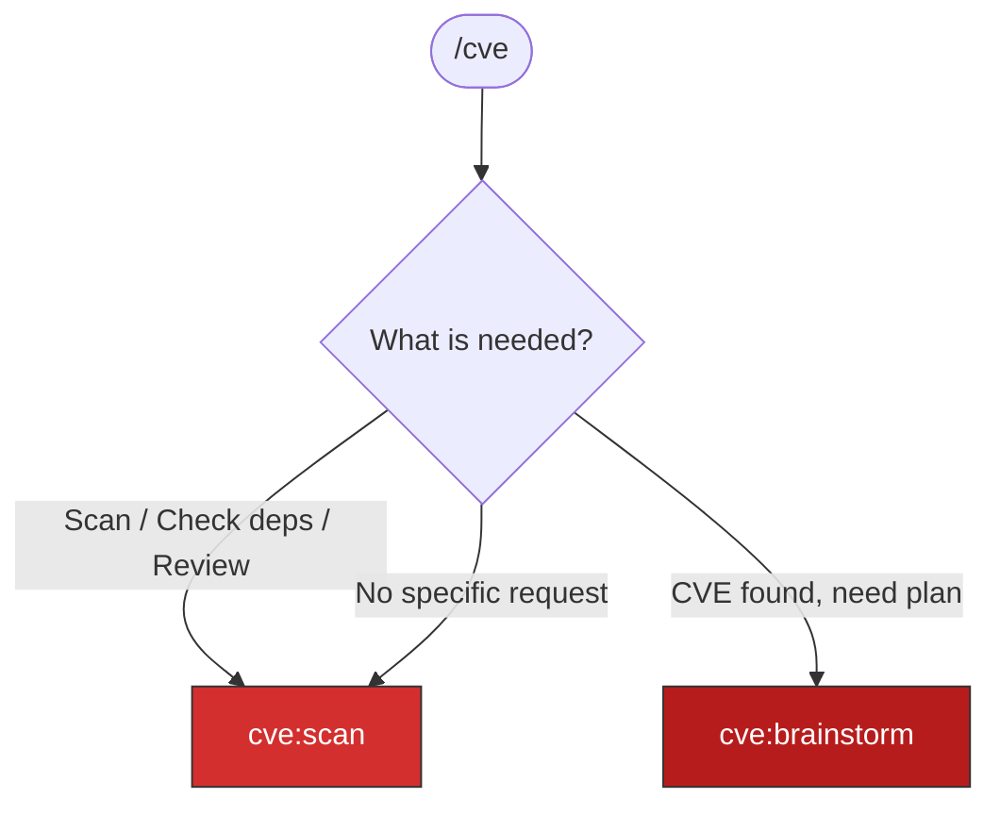

# CVE Awareness

Detect CVEs in project dependencies and source code, audit documentation for
CVE leaks, and ensure responsible disclosure before any public communication.

## IMPORTANT

Accidental public CVE disclosure enables exploitation before patches exist,
violates responsible disclosure agreements, and causes legal and reputational harm.
**Never include CVE IDs, vulnerability descriptions, or exploit details in any
public output** (PRs, issues, comments, commit messages) until the CVE has been
reported through proper channels.

## Router



When `/cve` is invoked, determine the entry point:

- **"Scan for CVEs"** / **"Check dependencies"** / **"Security review"** → `cve:scan`
- **CVE was found, need response plan** → `cve:brainstorm`
- **No specific request** → `cve:scan` (default: scan first)

## What cve:scan Covers

| Phase | Scanner | Focus |
|-------|---------|-------|
| 1 | Dependency inventory | All manifests: pyproject.toml, package.json, go.mod, Dockerfiles, Helm charts |
| 2 | Trivy (if available) | Filesystem + container image scanning |
| 3 | LLM + WebSearch | Known CVEs against NVD/Snyk/GitHub Advisories |
| 4 | Code security review | Auth, injection, secrets, containers, CI/CD, network patterns |
| 5 | Documentation audit | CVE references in .md files that could leak publicly |
| 6 | Combined report | `SUMMARY.md` in `.cves/` (gitignored) |

## When This Runs Automatically

These skills are invoked as mandatory gates in other workflows:

| Workflow | Gate Location | Skill |
|----------|---------------|-------|
| `tdd:ci` | Phase 3.5 (after local checks, before push) | `cve:scan` |
| `tdd:hypershift` | Pre-deploy (before cluster deployment) | `cve:scan` |
| `tdd:kind` | Pre-deploy (before cluster deployment) | `cve:scan` |
| `rca:*` | Phase 5 addendum (before documenting findings) | `cve:scan` |
| `git:commit` | Pre-commit (scan for CVE IDs in message) | CVE ID check |
| Finishing branch | Step 2.5 (before PR creation options) | `cve:scan` |

## Output Location

All scan results go to `.cves/` (gitignored):

```
.cves/
├── SUMMARY.md                    # Combined report (copy to Google Docs)
├── cve-scan-results.md           # Dependency CVE findings
├── security-review-results.md    # Source code security findings
├── md-audit-results.md           # Documentation CVE leak audit
├── trivy-fs.json                 # Trivy output (if available)
└── trivy-config-*.txt            # Trivy Dockerfile scans
```

## Related Skills

- `cve:scan` — Full scanning (dependencies + code + docs)
- `cve:brainstorm` — Disclosure planning and public output blocking
