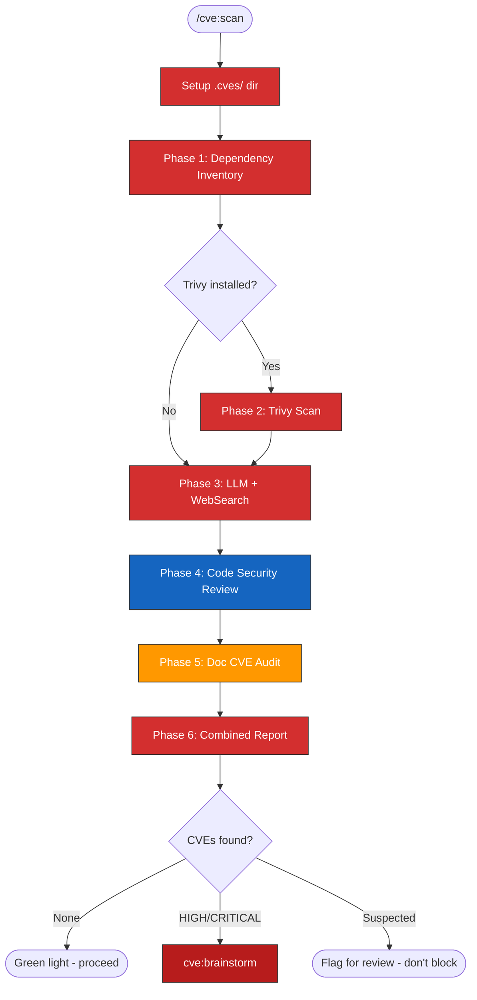

# CVE Scan

Comprehensive security scanning that combines dependency CVE detection, source
code security review, and documentation leak auditing.

## IMPORTANT: Output Safety

- Scan results are written to `.cves/` (gitignored) ONLY
- **NEVER** write CVE details to git-tracked files
- **NEVER** include CVE IDs in commit messages, PR descriptions, or issue comments
- Display findings to user in terminal only
- Ensure `.cves/` is in `.gitignore` before writing

## Workflow



> Follow this diagram as the workflow.

## Setup

### Ensure .cves/ directory exists and is gitignored

```bash
mkdir -p .cves
grep -q "^\.cves" .gitignore 2>/dev/null || echo -e "\n# CVE scan results (never commit)\n.cves/" >> .gitignore
```

## Phase 1: Dependency Inventory

Identify all dependency sources in the working tree.

### Find dependency files

Search for dependency manifests using Glob:

- `**/pyproject.toml` — Python projects
- `**/requirements*.txt` — Python requirements
- `**/uv.lock` — Python lock files
- `**/package.json`, `**/package-lock.json` — Node.js
- `**/go.mod`, `**/go.sum` — Go
- `**/Dockerfile*`, `**/Containerfile*` — Container base images
- `**/Chart.yaml` — Helm charts

### Extract dependency versions

Read each manifest and lock file. For lock files, extract resolved versions.
For Dockerfiles, extract `FROM` base images with tags.

Record the inventory as a table in the report:

```markdown
| File | Package | Version | Ecosystem |
|------|---------|---------|-----------|
```

## Phase 2: Trivy Scan (if available)

```bash
which trivy 2>/dev/null
```

```bash
trivy --version
```

If installed, run filesystem and config scans:

```bash
trivy fs --severity HIGH,CRITICAL --format json --output .cves/trivy-fs.json . 2>&1; echo "EXIT:$?"
```

For each Dockerfile found:

```bash
trivy config <Dockerfile-path> --output .cves/trivy-config-<name>.txt 2>&1; echo "EXIT:$?"
```

If not installed, note in the report and skip to Phase 3.

## Phase 3: LLM + WebSearch Analysis

For each key dependency from Phase 1 inventory, focus on:

### High-risk categories (always check)

- Crypto libraries: cryptography, pyca, openssl bindings
- Auth libraries: python-jose, PyJWT, keycloak-js, oauth
- Network libraries: urllib3, requests, httpx, axios
- Serialization: pyyaml, protobuf, pickle
- Container base images: nginx, python, node, alpine versions

### WebSearch verification

For flagged packages:

```
WebSearch: "<package> <version> CVE vulnerability 2025 2026"
```

Check against: NVD, Snyk, GitHub Advisory Database, OSV.dev

### Classify findings

| Confidence | Criteria | Action |
|------------|----------|--------|
| Confirmed | Trivy + WebSearch agree, or NVD entry exists | Report as confirmed |
| Suspected | LLM flags but WebSearch inconclusive | Report as suspected |
| Already fixed | Current version >= fix version | Report in "Already Patched" section |

## Phase 4: Source Code Security Review

Use Claude Code reasoning to scan source code for vulnerability patterns.
Launch as a background agent for parallel execution:

```
Task(subagent_type='general-purpose'):
  "Perform a security review of <repo-path>. Focus on:
   1. Auth: Missing auth on endpoints, hardcoded credentials, JWT validation issues
   2. Injection: SQL, command, template injection; unsanitized label selectors
   3. Secrets: Hardcoded API keys, default passwords in Helm/ConfigMaps
   4. Containers: Running as root, unpinned tags, missing healthchecks
   5. CI/CD: Unpinned actions, untrusted input in workflows, broad permissions
   6. Network: SSRF, disabled TLS verification, plain HTTP for auth endpoints
   7. Info disclosure: Verbose errors leaked to clients, exposed API docs

   Use Grep to search for dangerous patterns. Do NOT read entire large files.
   Write report to <repo-path>/.cves/security-review-results.md"
```

### Key patterns to search

```
# Auth gaps
Grep: "require_roles|get_current_user|Depends" in routers — find endpoints WITHOUT auth
Grep: "verify_aud.*False|verify_exp.*False" — disabled JWT validation
Grep: "password.*admin|ADMIN_PASSWORD.*admin" — hardcoded creds

# Injection
Grep: "label_selector=f\"|f\".*{.*}" in K8s client calls
Grep: "os.system|subprocess.call|eval(" — command injection
Grep: "detail=f\".*{str(e)}" — error detail leakage

# Secrets
Grep: "sk-proj-|ghp_|glpat-" — API keys in source
Grep: "FROM.*:latest" — unpinned base images

# Network
Grep: "verify=False|follow_redirects=True" — TLS/SSRF issues
Grep: "http://.*svc.cluster.local" — plain HTTP in-cluster

# CI/CD
Grep: "uses:.*@v[0-9]" in workflows — unpinned actions (should be SHA)
Grep: "pull_request_target" — dangerous trigger
```

## Phase 5: Documentation CVE Audit

Check all `.md` files for CVE references that could leak if published.

```
Grep: "CVE-\d{4}-\d+" across **/*.md
Grep: "vulnerability|exploit|security flaw" combined with package names
```

Check git commit history:

```bash
git log --oneline --all --grep="CVE-" | head -20
```

### Classify doc findings

| Risk | Criteria |
|------|----------|
| HIGH | CVE ID in a file that could become a public GitHub issue |
| MEDIUM | CVE ID in internal docs/plans (not public but should be cleaned) |
| LOW | Generic security discussion without specific CVE IDs |
| NONE | Upstream vendor CVE references (e.g., K8s Gateway API CRD comments) |

## Phase 6: Combined Report

Write `SUMMARY.md` to `.cves/` combining all scan results.

### Report structure

```markdown
# Security Scan Summary — <Project>
Date: <date>

## Executive Summary
[Top priority items table — HIGH findings from all phases]

## Part 1: Dependency CVE Findings
[From Phases 1-3: inventory, CVE table, already-patched list]

## Part 2: Source Code Security Review
[From Phase 4: HIGH/MEDIUM/LOW/INFO findings with file:line references]

## Part 3: Documentation CVE Audit
[From Phase 5: files with CVE references, commit messages, risk classification]

## Already Patched (No Action)
[Dependencies confirmed at or above fix versions]

## Remediation Priority
[Priority matrix: immediate / short-term / medium-term / long-term]
```

### For multi-repo scans

When scanning across repos (e.g., all kagenti org repos):

1. Clone each repo to `/tmp/kagenti-scan/<repo-name>` with `--depth 1 --branch main`
2. Run Phases 1-3 on each
3. Add a "Cross-Repo Security Gaps" section comparing CI scanning, Dependabot, action pinning, secret detection across repos
4. Separate findings by: upstream/main vs feature branches/worktrees

## When Invoked as a Gate

When `cve:scan` is invoked by another skill (tdd:ci, rca:*, etc.) as a gate:

- **Clean scan** → return control to the calling skill, proceed
- **Findings detected** → invoke `cve:brainstorm`, **BLOCK** the calling skill
  from proceeding to public output until the hold is resolved
- The calling skill must NOT proceed past the CVE gate until `cve:brainstorm`
  resolves the hold

## Related Skills

- `cve:brainstorm` — Disclosure planning when CVEs are found
- `tdd:ci` — Invokes this at Phase 3.5
- `tdd:hypershift` — Invokes this pre-deploy
- `tdd:kind` — Invokes this pre-deploy
- `rca:ci` — Invokes this at Phase 5
