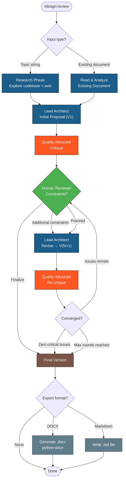

# Design Review

Structured adversarial review workflow for producing architectural designs, migration plans, RFCs, and technical proposals. Two simulated expert perspectives iterate on a design while a human reviewer provides constraints and direction at each round.

## Table of Contents

- [When to Use](#when-to-use)
- [Inputs](#inputs)
- [Workflow](#workflow)
- [Workflow Diagram](#workflow-diagram)
- [The Agents](#the-agents)
- [Round Structure](#round-structure)
- [Starting from a Topic](#starting-from-a-topic)
- [Starting from an Existing Document](#starting-from-an-existing-document)
- [Human Reviewer Interaction](#human-reviewer-interaction)
- [Convergence Criteria](#convergence-criteria)
- [Document Output](#document-output)
- [Task Tracking](#task-tracking)
- [Troubleshooting](#troubleshooting)
- [Related Skills](#related-skills)

## When to Use

- Designing a new system architecture or migration plan
- Writing an RFC or technical proposal that needs rigorous critique
- Refining an existing design document through structured adversarial review
- Any design task where multiple perspectives (implementer vs. quality advocate) improve outcomes

## Inputs

The skill accepts one of two starting points plus optional configuration:

| Input | Description | Example |
|-------|-------------|---------|
| **Topic** | A research question or design challenge | `"Migrate installer from Ansible to Kubernetes Operator"` |
| **Existing document** | File path to iterate on | `docs/architecture/migration-plan.md` |
| **Max iterations** | Number of review rounds (default: 5) | `--rounds 3` |
| **Role context** | Domain expertise for the agents | `"Senior Cloud Native Architect"` |
| **Focus areas** | Specific concerns to emphasize | `"RBAC security, OpenShift compatibility"` |

Invocation examples:

```
/design:review Migrate the Kagenti installer from Ansible/Helm to a Kubernetes Operator
/design:review docs/architecture/operator-migration.md
/design:review --rounds 3 Design an authentication gateway for multi-tenant agents
/design:review docs/rfc/007-observability.md --rounds 7 --focus "Day-2 operations, cost"
```

## Workflow

```
1. Parse input → Topic or Existing Document
2. If topic: Research phase (codebase exploration, web search)
3. Lead Architect produces initial proposal (V1)
4. Quality Advocate critiques V1
5. Ask Human Reviewer for constraints or "proceed"
6. Lead Architect revises → V(N+1)
7. Quality Advocate critiques V(N+1)
8. Ask Human Reviewer again
9. Repeat 5-8 until:
   a. Quality Advocate has zero critical issues, OR
   b. Max iterations reached, OR
   c. Human Reviewer says "finalize"
10. Present final version + offer document export
```

## Workflow Diagram



> Follow this diagram as the workflow.

## The Agents

Two simulated expert perspectives critique each other's work:

### Lead Architect (Proposer)

- **Role**: Proposes the design, CRD schemas, reconciliation logic, implementation strategy
- **Perspective**: Implementer — focuses on feasibility, developer experience, clean architecture
- **Output**: Versioned proposals (V1, V2, V3...) with concrete schemas, code samples, and diagrams
- **Adapts to**: Human reviewer constraints and Quality Advocate critiques

### Quality Advocate (Reviewer)

- **Role**: Critiques the proposal for operational failures, security gaps, complexity bloat
- **Perspective**: Adversarial — focuses on Day-2 operations, edge cases, blast radius, upgrade paths
- **Output**: Bulleted critique organized by severity (Critical > Major > Minor)
- **Severity definitions**:
  - **Critical**: Must fix before proceeding. Architecture won't work as designed.
  - **Major**: Significant risk. Could work but likely causes production incidents.
  - **Minor**: Improvement opportunity. Non-blocking but worth addressing.

### Adapting Agent Roles

The default roles (Architect + Quality Advocate) work for infrastructure/platform design. For other domains, adapt the perspectives to the problem:

| Domain | Proposer Role | Reviewer Role |
|--------|--------------|---------------|
| Infrastructure | Cloud Native Architect | SRE / Security Auditor |
| API Design | API Designer | API Consumer / DX Advocate |
| Data Architecture | Data Engineer | Data Governance / Privacy |
| Security | Security Architect | Red Team / Penetration Tester |
| UX/Product | Product Designer | Accessibility / Performance Advocate |

State the adapted roles explicitly at the start of Round 1 so the human reviewer knows the perspectives being applied.

## Round Structure

Each round follows this exact format:

### Lead Architect Section

```markdown
## Lead Architect: [Initial Proposal | Revised Plan] (V<N>)

[If V1: Present the full proposal with sections, schemas, code samples, diagrams]
[If V2+: Address each critique from the previous round, then present revised sections]

### [Section 1 Title]
[Content with code blocks, tables, diagrams as needed]

### [Section 2 Title]
...
```

### Quality Advocate Section

```markdown
## Quality Advocate: Critique of V<N>

### Critical Issues
- **[Issue title].** [Detailed explanation of why this is critical and what breaks.]

### Major Concerns
- **[Concern title].** [Explanation and suggested mitigation.]

### Minor Issues
- **[Issue title].** [Brief note.]
```

### Human Handoff

Every round ends with exactly this prompt:

```
**Human Reviewer:** Do you have additional constraints or should we proceed to the next internal review?
```

Wait for the human response before continuing.

## Starting from a Topic

When invoked with a topic string (no existing document):

### Step 1: Research Phase

Before the Lead Architect writes V1, conduct research:

1. **Codebase exploration** — Use the Explore agent to understand relevant code, existing patterns, and architecture

2. **Web research** (if needed) — Search for best practices, prior art, and industry patterns relevant to the topic

3. **Synthesize findings** — Compile research into context for the Lead Architect

The research phase should be thorough but time-boxed. Use subagents for codebase exploration to keep the main context clean.

### Step 2: Initial Proposal

The Lead Architect writes V1 grounded in the research findings. V1 should be comprehensive:

- Problem statement and motivation
- Proposed architecture with diagrams
- Concrete schemas / interfaces / API surfaces
- Implementation strategy with phases
- Known trade-offs and alternatives considered

## Starting from an Existing Document

When invoked with a file path:

### Step 1: Read and Analyze

Read the existing document in full. Understand:
- What decisions have already been made
- What's well-defined vs. underspecified
- What assumptions are stated vs. implicit

### Step 2: Quality Advocate First

Skip the Lead Architect's V1 — the existing document IS V1. Start directly with the Quality Advocate's critique of the document.

### Step 3: Normal Iteration

Continue with the standard round structure (Lead Architect revises, Quality Advocate re-critiques, human weighs in).

## Human Reviewer Interaction

The human reviewer has several options at each handoff:

| Response | Effect |
|----------|--------|
| **Additional constraints** | Lead Architect incorporates them into the next revision. State constraints explicitly at the top of the next Lead Architect section. |
| **"proceed"** / **"continue"** | Move to next round with no additional constraints. |
| **"finalize"** | Skip remaining rounds. Move directly to convergence and document export. |
| **Change iteration count** | e.g., "proceed, but let's do 3 more rounds" — adjust max rounds. |
| **Change focus** | e.g., "focus the next round on security only" — narrow the Quality Advocate's lens. |
| **Change roles** | e.g., "add a cost perspective" — adjust the adversarial lens. |

## Convergence Criteria

The review loop ends when ANY of these conditions are met:

1. **Quality Advocate reports zero Critical and zero Major issues** — the design has converged
2. **Max iterations reached** (default: 5) — present the best version achieved
3. **Human Reviewer says "finalize"** — explicit early termination

When converged, present:

```markdown
## Consolidated Decision Record

| Decision | Rationale | Round |
|----------|-----------|-------|
| [Decision 1] | [Why] | R<N> |
| [Decision 2] | [Why] | R<N> |
...
```

Then offer document export.

## Document Output

After convergence, offer the human reviewer export options:

```
The design has converged after N rounds. Would you like to export it?
1. **DOCX** — Generate a formatted Word document using python-docx
2. **Markdown** — Write to a .md file in the repo
3. **Both**
4. **None** — Keep it in the conversation only
```

### DOCX Generation

When DOCX is selected, generate a python-docx script that produces the document:

1. Create a Python script at the target location (e.g., `docs/architecture/generate-<topic>.py`)
2. The script uses `python-docx` to create a professionally formatted document with:
   - Title page with document metadata (version, date, status, authors)
   - Table of contents
   - All sections from the final version with proper heading hierarchy
   - Formatted tables (colored headers, alternating row shading)
   - Code blocks in monospace font
   - Decision record table
3. Run the script to produce the `.docx` file
4. Report the output path and file size

Install python-docx if needed:

```bash
pip3 show python-docx 2>/dev/null || pip3 install python-docx
```

### Markdown Generation

Write the final version as a clean markdown file with all sections, code blocks, tables, and the decision record. Use standard GitHub-flavored markdown.

## Task Tracking

On invocation:
1. TaskList — check existing tasks for this design review
2. TaskCreate with naming: `<repo> | <topic> | design:review | Round <N> | <description>`

Example tasks:

```
kagenti | operator-migration | design:review | Research | Explore codebase and current installer
kagenti | operator-migration | design:review | Round 1  | Initial proposal + critique
kagenti | operator-migration | design:review | Round 2  | Revise for RBAC + security
kagenti | operator-migration | design:review | Round 3  | Address productization constraints
kagenti | operator-migration | design:review | Export   | Generate DOCX document
```

Update task status as each round completes. Create new tasks when the human reviewer adds constraints that require research.

## Troubleshooting

### Problem: Rounds aren't converging
**Symptom**: Quality Advocate keeps finding new Critical issues at round 4-5.
**Fix**: Ask the human reviewer to narrow focus ("focus only on RBAC for this round"). Broad scope prevents convergence. Alternatively, increase max rounds.

### Problem: Lead Architect not addressing critiques
**Symptom**: Same Critical issue appears in multiple rounds.
**Fix**: The Lead Architect MUST explicitly address every Critical and Major issue from the previous round. If an issue is intentionally deferred, state why with a "Decision: Accept Risk" note.

### Problem: Design is too abstract
**Symptom**: Quality Advocate can't critique effectively because there are no concrete schemas or code.
**Fix**: The Lead Architect MUST include concrete artifacts: CRD YAML, Go interfaces, sequence diagrams, RBAC manifests. Abstract bullet points are not sufficient for review.

### Problem: python-docx not available
**Symptom**: DOCX generation fails.
**Fix**: Install with `pip3 install python-docx`. If pip is not available, fall back to Markdown export.

## Related Skills

- `meta:write-docs` - Documentation formatting guidelines
- `skills:write` - Create or edit skills
- `git:commit` - Commit the generated design document
- `repo:pr` - Create a PR for the design document
- `repo:issue` - Create a tracking issue for the design
