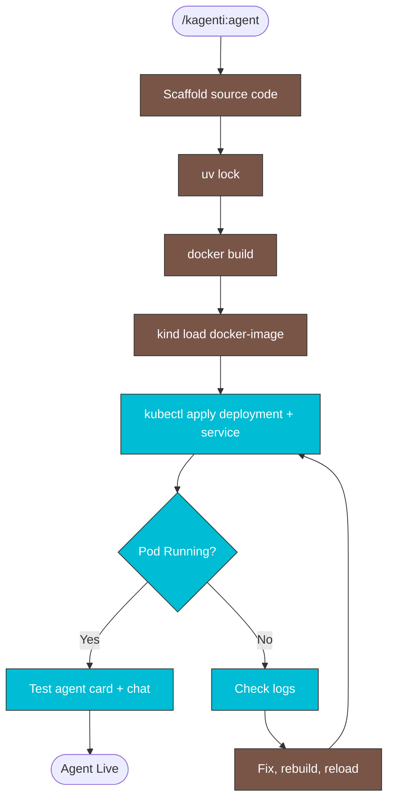

# Create and Deploy A2A Agent

## Table of Contents

- [When to Use](#when-to-use)
- [Reference Agent](#reference-agent)
- [Placeholder Substitution Checklist](#placeholder-substitution-checklist)
- [Workflow](#workflow)
- [Step 1: Scaffold Agent Source](#step-1-scaffold-agent-source)
- [Step 2: Build and Load Image](#step-2-build-and-load-image)
- [Step 3: Deploy to Cluster](#step-3-deploy-to-cluster)
- [Step 4: Verify](#step-4-verify)
- [Reference: File Templates](#reference-file-templates)
- [Gotchas](#gotchas)
- [Troubleshooting](#troubleshooting)
- [Related Skills](#related-skills)

## When to Use

- User asks to create a new AI agent for Kagenti
- User wants to deploy a custom A2A agent on a Kind cluster
- User asks "build an agent", "create a new agent", or "deploy agent to Kind"

## Reference Agent

The recipe_agent is a complete working example of a simple conversational agent:
- Source: `~/git/kagenti/agent-examples/a2a/recipe_agent/`
- Deployment: `kagenti/examples/agents/recipe_service_deployment.yaml`
- Service: `kagenti/examples/agents/recipe_service_service.yaml`

Read these files ONLY if the templates below are insufficient for your use case.

## Placeholder Substitution Checklist

Before writing files, determine these values from the user's request:

| Placeholder | Format | Example |
|-------------|--------|---------|
| `<AGENT_NAME>` | Python module name (snake_case) | `cheerup_agent` |
| `<AGENT-NAME>` | Kubernetes/Docker name (kebab-case) | `cheerup-agent` |
| `<AGENT_DISPLAY_NAME>` | Human-friendly name | `Cheerup Companion` |
| `<DESCRIPTION>` | Short description for pyproject.toml | `Conversational cheerup agent using Ollama.` |
| `<AGENT_CARD_DESCRIPTION>` | Markdown description for the A2A agent card (multi-line OK) | `This agent cheers you up...` |
| `<SYSTEM_PROMPT>` | The LLM system prompt defining agent behavior | `You are a cheerful companion...` |
| `<SKILL_ID>` | Skill identifier (snake_case) | `cheerup_assistant` |
| `<SKILL_NAME>` | Skill display name | `Cheerup Assistant` |
| `<SKILL_DESCRIPTION>` | Markdown skill description | `**Cheerup Assistant** – Cheers you up when you're down.` |
| `<TAGS>` | JSON list of tags | `["cheerup", "mood", "motivation"]` |
| `<EXAMPLES>` | JSON list of example prompts | `["I'm feeling down", "Cheer me up"]` |
| `<WORKING_STATUS>` | Status message while thinking | `Thinking of something cheerful...` |

## Workflow



> Follow this diagram as the workflow.

## Step 1: Scaffold Agent Source

Create files under `~/git/kagenti/agent-examples/a2a/<AGENT_NAME>/`:

```
~/git/kagenti/agent-examples/a2a/<AGENT_NAME>/
├── pyproject.toml
├── Dockerfile
├── .dockerignore
└── src/<AGENT_NAME>/
    ├── __init__.py          # OpenTelemetry tracer
    ├── configuration.py     # Pydantic settings (LLM_MODEL, LLM_API_BASE, LLM_API_KEY)
    ├── agent.py             # A2A server: AgentCard, Executor, health, run()
    └── <AGENT_NAME>_llm.py  # LLM logic (openai.AsyncOpenAI for Ollama)
```

Write ALL files directly from the templates below with placeholder substitution. Do NOT explore or read reference files.

### Critical pyproject.toml requirements

- Use `a2a-sdk[http-server]` (NOT plain `a2a-sdk`) — the `[http-server]` extra provides `starlette` and `sse-starlette`
- Do NOT include `readme = "README.md"` unless the file exists — hatchling build will fail
- Entry point: `[project.scripts] server = "<AGENT_NAME>.agent:run"`

## Step 2: Build and Load Image

Generate lockfile:

```bash
cd ~/git/kagenti/agent-examples/a2a/<AGENT_NAME>
```

```bash
uv lock
```

Build the Docker image:

```bash
docker build -t registry.cr-system.svc.cluster.local:5000/<AGENT-NAME>:v0.0.1 ~/git/kagenti/agent-examples/a2a/<AGENT_NAME>/
```

Load directly into Kind (no registry push needed):

```bash
kind load docker-image registry.cr-system.svc.cluster.local:5000/<AGENT-NAME>:v0.0.1 --name kagenti
```

## Step 3: Deploy to Cluster

Create two manifests under `kagenti/examples/agents/` using the deployment.yaml and service.yaml templates below.

### Apply

```bash
kubectl --context kind-kagenti apply -f kagenti/examples/agents/<AGENT_NAME>_deployment.yaml
```

```bash
kubectl --context kind-kagenti apply -f kagenti/examples/agents/<AGENT_NAME>_service.yaml
```

## Step 4: Verify

Check pod is running:

```bash
kubectl --context kind-kagenti -n team1 get pods -l app.kubernetes.io/name=<AGENT-NAME>
```

Check logs if not running:

```bash
kubectl --context kind-kagenti -n team1 logs deployment/<AGENT-NAME>
```

Port-forward and test agent card:

```bash
kubectl --context kind-kagenti -n team1 port-forward svc/<AGENT-NAME> 18080:8080
```

```bash
curl -s http://localhost:18080/.well-known/agent.json
```

```bash
curl -s http://localhost:18080/health
```

Send a test message (A2A JSON-RPC):

```bash
curl -s -X POST http://localhost:18080/ -H "Content-Type: application/json" -d '{"jsonrpc":"2.0","id":1,"method":"message/send","params":{"message":{"role":"user","parts":[{"type":"text","text":"Hello"}],"messageId":"test-1"}}}'
```

Or use the Kagenti UI at http://kagenti-ui.localtest.me:8080 → Agent Catalog → select agent → Chat.

## Reference: File Templates

### pyproject.toml

```toml
[project]
name = "<AGENT-NAME>"
version = "0.0.1"
description = "<DESCRIPTION>"
license = { text = "Apache" }
requires-python = ">=3.11"
dependencies = [
    "a2a-sdk[http-server]>=0.2.16",
    "openai>=1.0.0",
    "pydantic-settings>=2.8.1",
    "uvicorn>=0.30.0",
    "opentelemetry-exporter-otlp",
]

[project.scripts]
server = "<AGENT_NAME>.agent:run"

[build-system]
requires = ["hatchling"]
build-backend = "hatchling.build"
```

### Dockerfile

```dockerfile
FROM ghcr.io/astral-sh/uv:python3.12-bookworm-slim
ARG RELEASE_VERSION="main"

WORKDIR /app
COPY . .
RUN uv sync --no-cache --locked --link-mode copy

ENV PRODUCTION_MODE=True \
    RELEASE_VERSION=${RELEASE_VERSION}

RUN chown -R 1001:1001 /app
USER 1001

CMD ["uv", "run", "--no-sync", "server", "--host", "0.0.0.0", "--port", "8000"]
```

### .dockerignore

```
.venv
```

### configuration.py

```python
from pydantic_settings import BaseSettings

class Configuration(BaseSettings):
    llm_model: str = "qwen3:4b"
    llm_api_base: str = "http://localhost:11434/v1"
    llm_api_key: str = "dummy"
```

### __init__.py (OpenTelemetry)

```python
from opentelemetry.sdk.resources import Resource
from opentelemetry import trace
from opentelemetry.sdk.trace import TracerProvider
from opentelemetry.sdk.trace.export import BatchSpanProcessor
from opentelemetry.exporter.otlp.proto.http.trace_exporter import OTLPSpanExporter

def setup_tracer():
    resource = Resource.create(attributes={
        "service.name": "<AGENT-NAME>",
    })
    provider = TracerProvider(resource=resource)
    processor = BatchSpanProcessor(OTLPSpanExporter())
    provider.add_span_processor(processor)
    trace.set_tracer_provider(provider)

setup_tracer()
```

### agent.py

```python
import logging

import uvicorn
from starlette.requests import Request
from starlette.responses import JSONResponse
from starlette.routing import Route
from textwrap import dedent

from a2a.server.agent_execution import AgentExecutor, RequestContext
from a2a.server.apps import A2AStarletteApplication
from a2a.server.events.event_queue import EventQueue
from a2a.server.request_handlers import DefaultRequestHandler
from a2a.server.tasks import InMemoryTaskStore, TaskUpdater
from a2a.types import AgentCapabilities, AgentCard, AgentSkill, TaskState, TextPart
from a2a.utils import new_agent_text_message, new_task

from <AGENT_NAME>.<AGENT_NAME>_llm import chat

logging.basicConfig(level=logging.DEBUG)
logger = logging.getLogger(__name__)


def get_agent_card(host: str, port: int):
    """Returns the Agent Card for <AGENT_DISPLAY_NAME>."""
    capabilities = AgentCapabilities(streaming=True)
    skill = AgentSkill(
        id="<SKILL_ID>",
        name="<SKILL_NAME>",
        description="<SKILL_DESCRIPTION>",
        tags=<TAGS>,
        examples=<EXAMPLES>,
    )
    return AgentCard(
        name="<AGENT_DISPLAY_NAME>",
        description=dedent(
            """\
            <AGENT_CARD_DESCRIPTION>
            """,
        ),
        url=f"http://{host}:{port}/",
        version="1.0.0",
        default_input_modes=["text"],
        default_output_modes=["text"],
        capabilities=capabilities,
        skills=[skill],
    )


class <EXECUTOR_CLASS>(AgentExecutor):
    """Handles <AGENT_DISPLAY_NAME> execution for A2A."""

    async def execute(self, context: RequestContext, event_queue: EventQueue):
        task = context.current_task
        if not task:
            task = new_task(context.message)
            await event_queue.enqueue_event(task)
        task_updater = TaskUpdater(event_queue, task.id, task.context_id)

        user_input = context.get_user_input()
        logger.info("<AGENT_DISPLAY_NAME> received: %s (context=%s)", user_input, task.context_id)

        await task_updater.update_status(
            TaskState.working,
            new_agent_text_message(
                "<WORKING_STATUS>",
                task_updater.context_id,
                task_updater.task_id,
            ),
        )

        try:
            reply = await chat(task.context_id, user_input)

            parts = [TextPart(text=reply)]
            await task_updater.add_artifact(parts)
            await task_updater.update_status(
                TaskState.input_required,
                new_agent_text_message(
                    reply,
                    task_updater.context_id,
                    task_updater.task_id,
                ),
            )
        except Exception as e:
            logger.error("<AGENT_DISPLAY_NAME> error: %s", e)
            parts = [TextPart(text=f"Sorry, I encountered an error: {e}")]
            await task_updater.add_artifact(parts)
            await task_updater.failed()

    async def cancel(self, context: RequestContext, event_queue: EventQueue) -> None:
        raise Exception("cancel not supported")


async def health(request: Request) -> JSONResponse:
    return JSONResponse({"status": "ok"})


async def agent_card_compat(request: Request) -> JSONResponse:
    """Serve agent card at /.well-known/agent-card.json for Kagenti backend compatibility."""
    card = get_agent_card(host="0.0.0.0", port=8000)
    return JSONResponse(card.model_dump(mode="json", exclude_none=True))


def run():
    """Runs the A2A Agent application."""
    agent_card = get_agent_card(host="0.0.0.0", port=8000)

    request_handler = DefaultRequestHandler(
        agent_executor=<EXECUTOR_CLASS>(),
        task_store=InMemoryTaskStore(),
    )

    server = A2AStarletteApplication(
        agent_card=agent_card,
        http_handler=request_handler,
    )

    app = server.build()

    # Add custom routes
    app.routes.insert(0, Route("/health", health, methods=["GET"]))
    app.routes.insert(0, Route("/.well-known/agent-card.json", agent_card_compat, methods=["GET"]))

    uvicorn.run(app, host="0.0.0.0", port=8000)
```

> **Note**: `<EXECUTOR_CLASS>` is the PascalCase executor class name, e.g., `CheerupExecutor`. Derive it from the agent name.

### <AGENT_NAME>_llm.py

```python
import logging
from collections import defaultdict

from openai import AsyncOpenAI

from <AGENT_NAME>.configuration import Configuration

logger = logging.getLogger(__name__)

SYSTEM_PROMPT = (
    "<SYSTEM_PROMPT>"
)

# Conversation memory keyed by context_id
_conversations: dict[str, list[dict[str, str]]] = defaultdict(list)


async def chat(context_id: str, user_message: str) -> str:
    """Send a message and get a response, maintaining conversation history."""
    config = Configuration()

    client = AsyncOpenAI(
        base_url=config.llm_api_base,
        api_key=config.llm_api_key,
    )

    history = _conversations[context_id]
    history.append({"role": "user", "content": user_message})

    messages = [{"role": "system", "content": SYSTEM_PROMPT}] + history

    logger.info("Sending %d messages to LLM for context %s", len(messages), context_id)

    response = await client.chat.completions.create(
        model=config.llm_model,
        messages=messages,
    )

    assistant_message = response.choices[0].message.content
    history.append({"role": "assistant", "content": assistant_message})

    logger.info("LLM response for context %s: %s", context_id, assistant_message[:200])
    return assistant_message
```

### deployment.yaml (`kagenti/examples/agents/<AGENT_NAME>_deployment.yaml`)

```yaml
# Deployment manifest for <AGENT-NAME>
# <DESCRIPTION>
apiVersion: apps/v1
kind: Deployment
metadata:
  name: <AGENT-NAME>
  namespace: team1
  labels:
    kagenti.io/type: agent
    protocol.kagenti.io/a2a: ""
    kagenti.io/framework: OpenAI
    kagenti.io/workload-type: deployment
    app.kubernetes.io/name: <AGENT-NAME>
    app.kubernetes.io/managed-by: kagenti-e2e
    app.kubernetes.io/component: agent
  annotations:
    kagenti.io/description: "<DESCRIPTION>"
    kagenti.io/shipwright-build: <AGENT-NAME>
spec:
  replicas: 1
  selector:
    matchLabels:
      kagenti.io/type: agent
      app.kubernetes.io/name: <AGENT-NAME>
  template:
    metadata:
      labels:
        kagenti.io/type: agent
        protocol.kagenti.io/a2a: ""
        kagenti.io/framework: OpenAI
        app.kubernetes.io/name: <AGENT-NAME>
    spec:
      containers:
      - name: agent
        image: registry.cr-system.svc.cluster.local:5000/<AGENT-NAME>:v0.0.1
        imagePullPolicy: Never
        env:
        - name: PORT
          value: "8000"
        - name: HOST
          value: "0.0.0.0"
        - name: OTEL_EXPORTER_OTLP_ENDPOINT
          value: "http://otel-collector.kagenti-system.svc.cluster.local:8335"
        - name: LLM_API_BASE
          value: "http://host.containers.internal:11434/v1"
        - name: LLM_API_KEY
          value: "dummy"
        - name: LLM_MODEL
          value: "qwen3:4b"
        - name: UV_CACHE_DIR
          value: "/app/.cache/uv"
        ports:
        - containerPort: 8000
          name: http
          protocol: TCP
        resources:
          requests:
            cpu: 100m
            memory: 256Mi
          limits:
            cpu: 500m
            memory: 1Gi
        volumeMounts:
        - name: cache
          mountPath: /app/.cache
      volumes:
      - name: cache
        emptyDir: {}
```

### service.yaml (`kagenti/examples/agents/<AGENT_NAME>_service.yaml`)

```yaml
# Service manifest for <AGENT-NAME>
# Companion to <AGENT_NAME>_deployment.yaml
apiVersion: v1
kind: Service
metadata:
  name: <AGENT-NAME>
  namespace: team1
  labels:
    kagenti.io/type: agent
    protocol.kagenti.io/a2a: ""
    app.kubernetes.io/name: <AGENT-NAME>
    app.kubernetes.io/managed-by: kagenti-e2e
spec:
  type: ClusterIP
  selector:
    kagenti.io/type: agent
    app.kubernetes.io/name: <AGENT-NAME>
  ports:
  - name: http
    port: 8080
    targetPort: 8000
    protocol: TCP
```

## Gotchas

These are hard-won lessons from real deployments:

| Issue | Cause | Fix |
|-------|-------|-----|
| `OSError: Readme file does not exist: README.md` | `readme = "README.md"` in pyproject.toml but no file | Remove the `readme` line from pyproject.toml |
| `ModuleNotFoundError: No module named 'starlette'` | Using plain `a2a-sdk` | Use `a2a-sdk[http-server]` |
| `ImportError: sse-starlette required` | Same — missing http-server extra | Use `a2a-sdk[http-server]` |
| `Failed to initialize cache at /.cache/uv` | UV_CACHE_DIR not set in deployment | Add `UV_CACHE_DIR=/app/.cache/uv` env var |
| `ErrImagePull` / `ImagePullBackOff` | `imagePullPolicy: Always` with `kind load` | Set `imagePullPolicy: Never` |
| `Connection error` from agent to LLM | `dockerhost` doesn't resolve in Kind | Use `host.containers.internal` (podman) or `host.docker.internal` (Docker) |
| LLM returns error | Model not installed in Ollama | Run `ollama list` to check, use an available model |

## Troubleshooting

### Problem: Pod crashes on startup
**Symptom**: Pod in `Error` or `CrashLoopBackOff`

Check logs:

```bash
kubectl --context kind-kagenti -n team1 logs deployment/<AGENT-NAME>
```

Common causes: missing Python dependency, bad import, permission error. Fix source, rebuild image, `kind load`, then restart:

```bash
kubectl --context kind-kagenti -n team1 rollout restart deployment/<AGENT-NAME>
```

### Problem: Agent can't reach Ollama
**Symptom**: `Connection error` or `Connection refused` in agent response

Verify Ollama is running on host:

```bash
curl -s http://localhost:11434/v1/models
```

Test connectivity from inside the pod:

```bash
kubectl --context kind-kagenti -n team1 exec deployment/<AGENT-NAME> -- python3 -c "import urllib.request; print(urllib.request.urlopen('http://host.containers.internal:11434/v1/models', timeout=5).read().decode()[:100])"
```

### Problem: Agent not visible in Kagenti UI
**Symptom**: Agent doesn't appear in Agent Catalog

Verify the `/.well-known/agent-card.json` endpoint returns valid JSON. The Kagenti backend discovers agents via this path. Ensure the custom Starlette route is registered.

## Shipwright Build (for CI/production)

For deploying via Shipwright instead of `kind load`, create additional manifests. These pull source from GitHub and build in-cluster:

- `<agent>_shipwright_build.yaml` — Build CR pointing to `agent-examples` repo
- `<agent>_shipwright_buildrun.yaml` — BuildRun CR to trigger
- Change `imagePullPolicy` back to `Always` in the deployment

See `kagenti/examples/agents/weather_agent_shipwright_build.yaml` for the template.

## Related Skills

- `kagenti:operator` — Deploy Kagenti platform and demo agents
- `kagenti:deploy` — Deploy Kind cluster
- `k8s:pods` — Debug pod issues
- `k8s:logs` — Query component logs
- `k8s:health` — Check platform health
