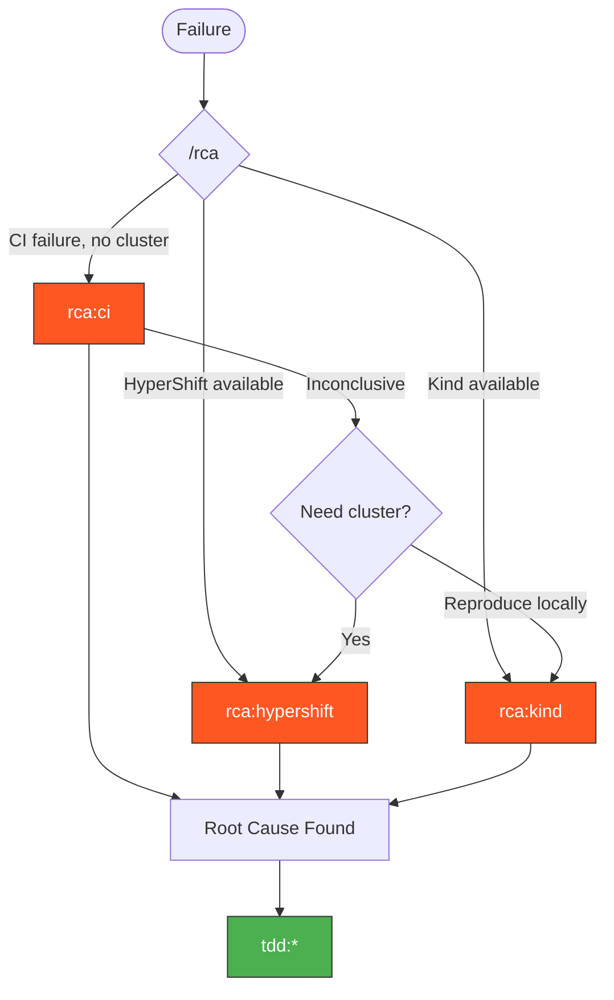

> Follow this diagram as the workflow.

# RCA Skills

Root cause analysis workflows for systematic failure investigation.

## Context-Safe Execution (MANDATORY)

**RCA is the highest-risk activity for context pollution.** Investigation involves
reading CI logs, kubectl output, and test results — all of which must stay out of
the main conversation context.

```bash
# Session-scoped log directory
export LOG_DIR=/tmp/kagenti/rca/$(basename $(git rev-parse --show-toplevel))
mkdir -p $LOG_DIR
```

**Rules:**
1. **ALL diagnostic commands** redirect output to `$LOG_DIR/<name>.log`
2. **ALL log analysis** happens in subagents: `Task(subagent_type='Explore')`
3. The subagent reads the log, extracts findings, and returns a concise summary
4. The main context only sees: exit codes, OK/FAIL status, and subagent summaries
5. **NEVER** read CI logs, kubectl output, or test results directly in main context

## Auto-Select Sub-Skill

When this skill is invoked, determine the right sub-skill based on context:

### Step 1: Determine what's available

Check for HyperShift cluster:

```bash
ls ~/clusters/hcp/kagenti-hypershift-custom-*/auth/kubeconfig 2>/dev/null
```

Check for Kind cluster:

```bash
kind get clusters 2>/dev/null
```

### Step 2: Route based on failure source and access

```
Where did the failure occur?
    │
    ├─ CI pipeline (GitHub Actions) ─────────────────────────┐
    │                                                         │
    │   Do you have a live cluster matching the CI env?       │
    │       │                                                 │
    │       ├─ HyperShift cluster available                   │
    │       │   → Use `rca:hypershift` (deep investigation)   │
    │       │                                                 │
    │       ├─ Kind cluster available (for Kind CI failures)  │
    │       │   → Use `rca:kind` (reproduce locally)          │
    │       │                                                 │
    │       └─ No cluster                                     │
    │           → Use `rca:ci` (logs and artifacts only)      │
    │           → If inconclusive, ask user to create cluster │
    │                                                         │
    ├─ Local Kind cluster ──────────────────────────────────┐ │
    │   → Use `rca:kind` (full local access)                │ │
    │                                                       │ │
    └─ HyperShift cluster ─────────────────────────────────┐│ │
        → Use `rca:hypershift` (full remote access)        ││ │
                                                           ││ │
After RCA is complete, switch to TDD for fix iteration: ◄──┘┘ │
    - `tdd:ci` (CI-only)                                       │
    - `tdd:hypershift` (live cluster)                          │
    - `tdd:kind` (local cluster)                               │
```

## Available Skills

| Skill | Access | Auto-approve | Best for |
|-------|--------|--------------|----------|
| `rca:ci` | CI logs/artifacts only | N/A | CI failures, no cluster |
| `rca:hypershift` | Full cluster access | All read ops | Deep investigation |
| `rca:kind` | Full local access | All ops | Kind failures, fast repro |

> **Concurrency limit**: Only one `rca:kind` session at a time (one Kind cluster fits locally).
> Before routing to `rca:kind`, run `kind get clusters` — if a cluster exists from another session,
> route to `rca:ci` instead or ask the user.

## CVE Awareness

All RCA variants include a CVE check before publishing findings. If the root
cause involves a dependency issue, `cve:scan` runs automatically to check for
known CVEs. If found, `cve:brainstorm` blocks public disclosure until the CVE
is properly reported through the project's security channels.

See `cve:scan` and `cve:brainstorm` for details.

## Related Skills

- `tdd:ci` - Fix iteration after RCA (CI-driven)
- `tdd:hypershift` - Fix iteration with live cluster
- `tdd:kind` - Fix iteration on Kind
- `k8s:logs` - Query and analyze component logs
- `k8s:pods` - Debug pod issues
- `cve:scan` - CVE scanning gate
- `cve:brainstorm` - CVE disclosure planning
